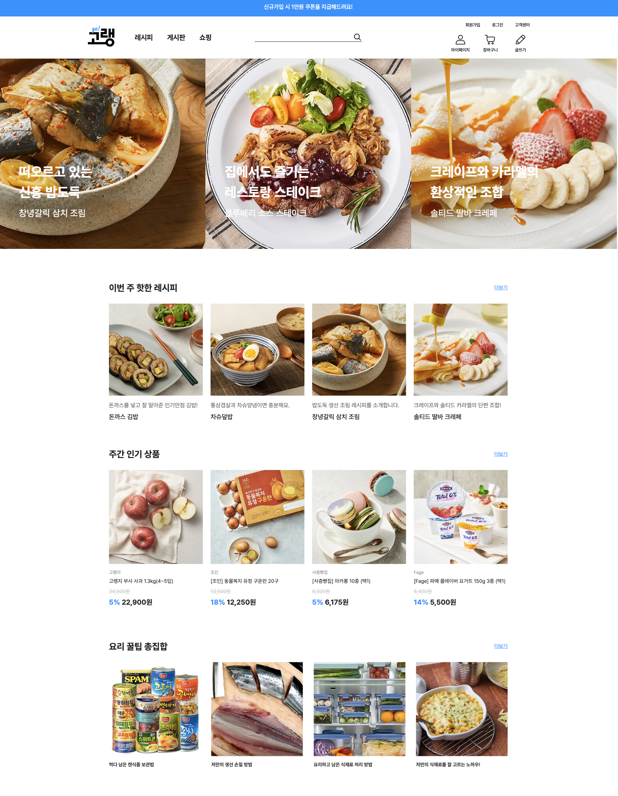
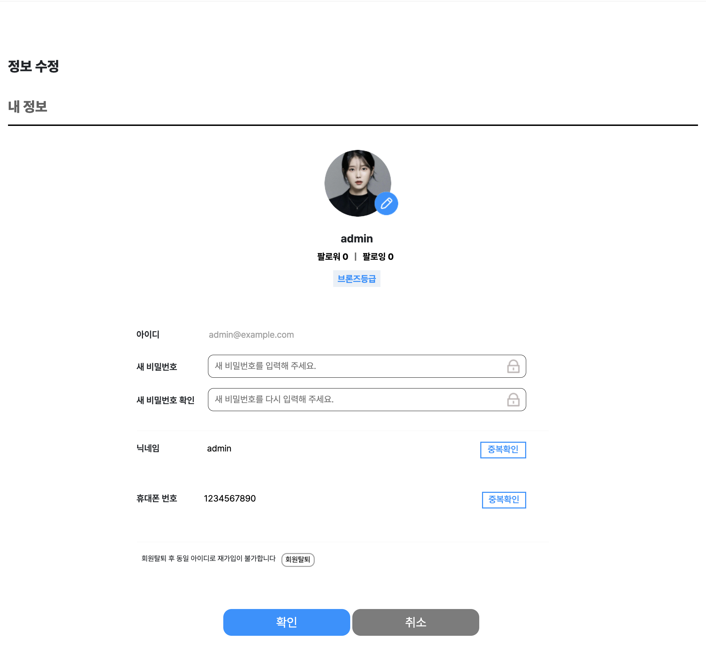

# 고수의 냉장고(Gorang)

- URL: https://www.gorang.store/

## 프로젝트 소개
- **재료 관리**: 사용자의 냉장고에 있는 재료를 손쉽게 등록하고 관리하여, 식재료를 효율적으로 활용할 수 있도록 도와줍니다.
- **레시피 공유**: 나만의 레시피를 등록해 다른 이용자들과 공유하고, 요리 경험을 나누며 소통할 수 있습니다.
- **커뮤니티**: 레시피 외에도 일상 이야기, 꿀팁 등 다양한 주제로 게시글을 작성하고, 이용자들과 일상을 공유할 수 있습니다.
- **편리한 쇼핑**: 필요한 재료를 구매할 수 있는 기능을 제공합니다.

## 팀원 구성
- [김동현(팀장)](https://github.com/DHKim96)
- [오동건(형상관리)](https://github.com/lildgman)
- [함유철(DB관리)](https://github.com/gkadbcjf)
- [이강산(일정 및 이슈 관리)](https://github.com/kangsan1023)

### 역할분담
#### 김동현
- 구매페이지, 사이드바, 헤더, 푸터
- 나의 냉장고, 구매내역, 쇼핑 상세, 로그인, 회원가입
- Google, Kakao, Naver 로그인 API, Coolsms 핸드폰 문자인증 API, 이메일 인증 SMTP
- 배포

#### 오동건
- 마이페이지 모두보기, 나의 게시글, 댓글 및 후기, 문의, 스크랩, 좋아요, 회원정보 수정
- 통합 검색 페이지, 레시피 리스트 페이지, 상품 리스트 페이지
- 관리자 페이지

#### 함유철
- 레시피 상세, 레시피 글쓰기, 레시피 수정
- DB 설계 및 데이터 관리

#### 이강산
- 게시판 메인, 게시판 상세, 게시판 글쓰기

## 개발 기간
- 아이디어 도출 및 UI 구상: 2024-04-29 ~ 2024-05-03
- UI구현: 2024-05-03 ~ 2024-05-14
- 기능 구현: 2024-05-14 ~ 2024-06-21

## 기술 스택
### 개발환경
#### Front-End
  

#### Back-End

#### Database

#### Collaboration Tool

## 화면 구성
### 메인화면

### 검색결과 페이지

### 레시피 메인화면

### 레시피 목록

### 레시피 상세

### 레시피 작성

### 게시글 목록

### 게시글 상세

### 게시글 작성

### 쇼핑 메인

### 쇼핑 목록

### 상품 상세

### 장바구니 페이지

### 구매 페이지

### 관리자 페이지 - 상품 등록

### 관리자 페이지 - 상품 조회

### 관리자 페이지 - 게시글

### 관리자 페이지 - 회원관리

### 마이페이지

### 마이페이지 - 게시글

### 마이페이지 - 댓글 및 후기

### 마이페이지 - 문의

### 마이페이지 - 나의 냉장고

### 마이페이지 - 구매내역

### 마이페이지 - 스크랩

### 마이페이지 - 좋아요

### 마이페이지 - 정보수정

### 회원탈퇴

